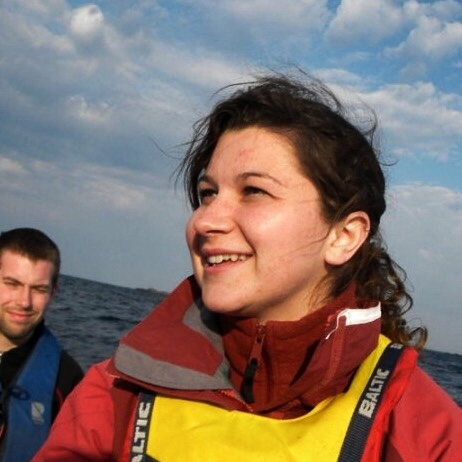
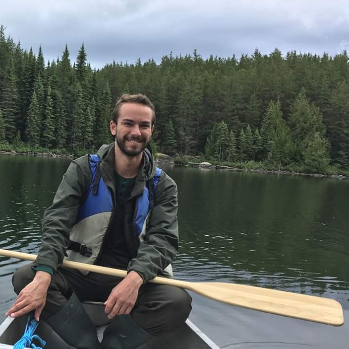
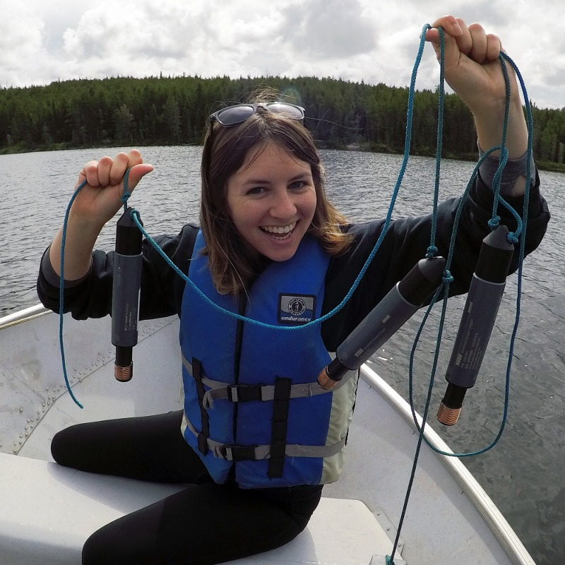

# Current Members

### Jason Venkiteswaran

{: class="bio-photo"} 

My research is currently focused on the biogeochemical cycling of nutrients and related elements, and human and climate related disruptions of these cycles. For more than a decade,  I have conducted whole-ecosystem research at the world-renowned [Experimental Lakes Area](https://www.iisd.org/ela/) studying reservoir creation, ecosystem metabolism and eutrophication. To study the fate of biogeochemical elements, I often use stable isotope measurements with process-based ecological models. I am a co-founder of the [Coalition to Save ELA](https://saveela.org).

### Megan L. Larsen, Postdoctoral fellow

{: class="bio-photo"}

Megan Larsen is a microbial evolutionary ecologist with a focus in eco-evolutionary feedbacks in microbial communities induced by nutrient stoichiometry. At present, she is investigating predictive models for cyanobacterial bloom formation as part of the cross-institutional [FORMBLOOM](http://gwf.usask.ca/science/pillar-3-projects.php#ForecastingToolsandMitigationOptionsforDiverseBloomAffectedLakes) project. 

Larsen recently completed a one-year postdoctoral position at the University of Nebraska-Lincoln [Water Sciences Laboratory](http://watersciences.unl.edu/) (WSL) where she provided expertise in specialized methods for water quality analysis and oversaw technical training within the facility. Her research at the WSL focused on emerging and persistent contaminants in groundwater and surface waters such as pesticides, nitrates, and cyanobacterial toxins across Nebraska and in the Ganges River ecosystem in India. Larsen received her PhD from Indiana University in 2016. Her dissertation work focused on how ratios of elements such as nitrogen and phosphorus shape the ecological, evolutionary, and molecular interactions between bacteria and phage.

Read more about Larsen's research, professional development for students, and scientific outreach on her [personal webpage](https://meganllarsen.wordpress.com).

### Jared Wolfe, Research associate

{: class="bio-photo"}

Jared completed his MSc at the University of Regina studying the impacts of Oil Sands industrial development on historical algal communities in northern Saskatchewan. He is currently investigating harmful algal bloom formation and decline in the [Experimental Lakes Area](https://www.iisd.org/ela/) as part of the [FORMBLOOM](http://gwf.usask.ca/science/pillar-3-projects.php#ForecastingToolsandMitigationOptionsforDiverseBloomAffectedLakes) (Forecasting Tools and Mitigation Options for Diverse Bloom-Affected Lakes) project. His interests are in studying relationships between ecosystem components, particularly the relationship between humans and the environment.

### Rachel Henderson, MSc student

{: class="bio-photo"}

Rachel completed her BSc in Environmental Science at the University of Waterloo. She is currently studying the role of particulate organic matter in iron uptake and fractionation by cyanobacteria at the Experimental Lakes Area, and how this may differ between eutrophic and oligotrophic lakes. She is interested in the applications of geochemistry to solving environmental problems, and how science can better inform public policy.

### Puru Shah, MSc student

{: class="bio-photo"} 

Puru has just finished his undergrad from University of Waterloo in Biochemistry. Through the co-op program, he has worked at Environment and Climate Change Canada researching harmful algal blooms. His thesis work will be looking at algal and cyanobacterial cultures and how they interact with and take up iron to hopefully better understand the role of iron in harmful algal bloom formation.

### JA, MSc student

# Former Members

### BB, BSc student

BB assessed the patterns of land cover diversity at the Experimental Lakes Area.

### Tyler Prentice, BSc student

{: class="bio-photo"} 

TP quantified the impacts of freeze-thaw cycles on nutrient release by riparian vegetation. This was a contribution to the multi-university [lugnuts](https://biogeochem.github.io/lugnuts/), linked undergraduate research in nutrients.

# Friends

Friends are our collaborators at a variety of organizations. In some cases they are co-supervisors, committee members, and/or co-applicants on grants. Often they are co-authors on our papers. In all cases, they are the extended group of people I like to work with. <!-- In alphatical order: Helen Baulch, Nora Casson, Scott Higgins, Lewis Molot, Josh Neufeld, Rebecca North, Michael Paterson, Sherry Schiff, and Colin Whitfield. -->
