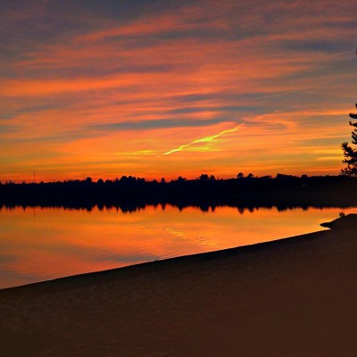
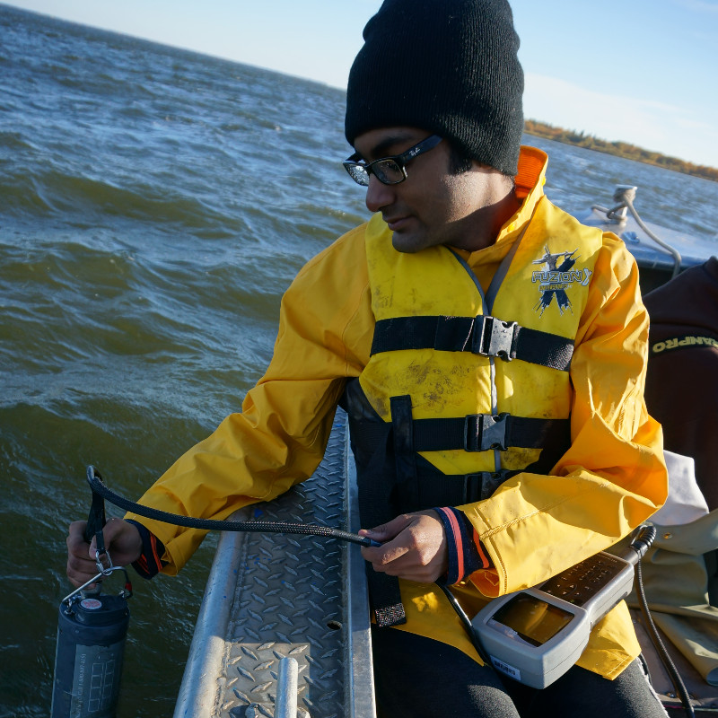
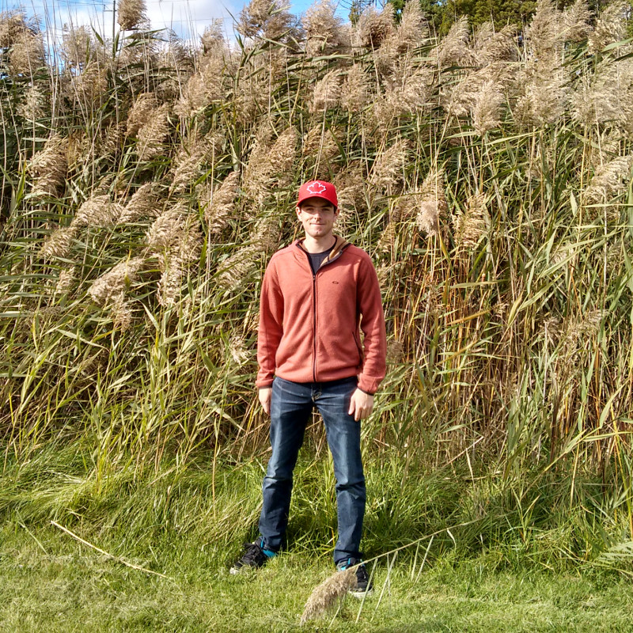

<h1> Current Members </h1>

<h3> Jason Venkiteswaran </h3>

My research is currently focused on the biogeochemical cycling of nutrients and related elements, and human and climate related disruptions of these cycles. For more than a decade,  I have conducted whole-ecosystem research at the world-renowned <a href="https://www.wlu.ca/academics/faculties/faculty-of-arts/faculty-profiles/jason-venkiteswaran/index.html#https://www.iisd.org/ela/">Experimental Lakes Area</a> studying reservoir creation, ecosystem metabolism and eutrophication. To study the fate of biogeochemical elements, I often use stable isotope measurements with process-based ecological models. I am a co-founder of the <a href="https://saveela.org">Coalition to Save ELA</a>.

<h3> MLL, Postdoctoral fellow </h3>

graf

<h3> JW, Research associate </h3>

graf

<h3> RIH, MSc student </h3>

graf

<h3> Puru Shah, MSc student </h3>

Puru has just finished his undergrad from University of Waterloo in Biochemistry. Through the co-op program, he has worked at Environment and Climate Change Canada researching harmful algal blooms. His thesis work will be looking at algal and cyanobacterial cultures and how they interact with and take up iron to hopefully better understand the role of iron in harmful algal bloom formation.

<h3> JA, MSc student </h3>

<h1> Former Members </h1>

<h3> BB, BSc student </h3>

BB assessed the patterns of land cover diversity at the Experimental Lakes Area.

<h3> Tyler Prentice, BSc student </h3>

TP quantified the impacts of freeze-thaw cycles on nutrient release by riparian vegetation. This was a contribution to the multi-university <a href="https://biogeochem.github.io/lugnuts/">luguts</a>, linked undergraduate research in nutrients.

